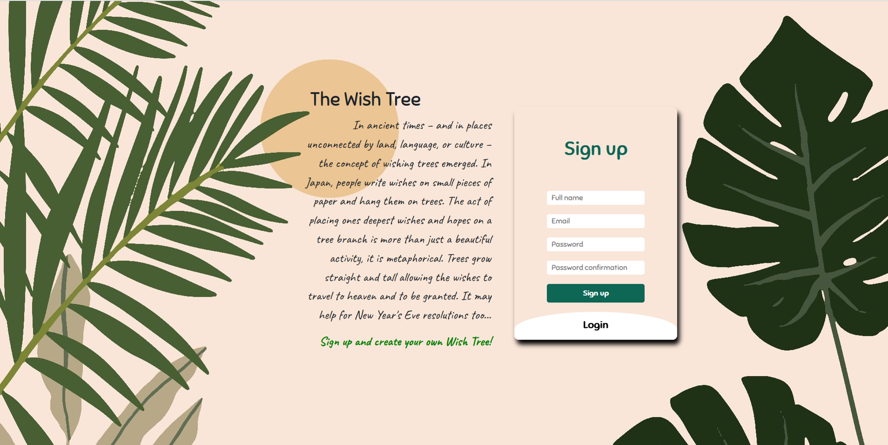
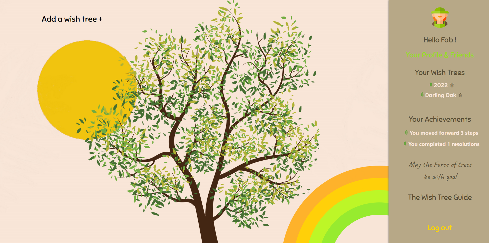
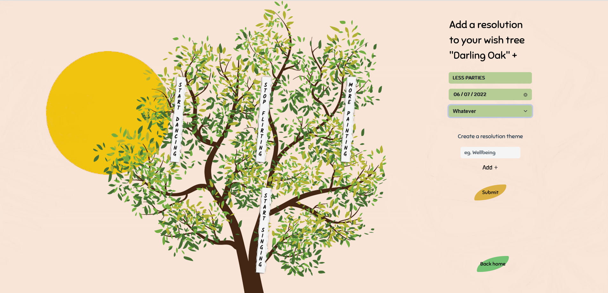

# End of Backend Specialisation Project

> Create a wish tree on line.

## Table of Contents
- [End of Backend Specialisation Project](#end-of-backend-specialisation-project)
  - [Table of Contents](#table-of-contents)
  - [General Information](#general-information)
  - [Technologies Used](#technologies-used)
  - [Features](#features)
  - [Setup](#setup)
  - [Documentation](#documentation)
  - [Other information](#other-information)
  - [Project Status](#project-status)

## General Information

WishTree is a carefully designed to-do app and at the same time a self-improvement companion. Users put their resolutions for the current year in a tree. They can see their progress, get a recap at the end of the year and share their achievements with their friends! 
- A tree symbolizing the current year, Users pin their resolutions on it.
- Resolutions represent the new year's resolutions for example.
- Every resolution contain steps (short term goals).

## Technologies Used

- Laravel 9.14.0 for the backend
- Vue.js 3/vue-cli 5.0.3 for the front including Axios 0.25 for API requests management
- API deployed on https://wishtreeapi.herokuapp.com/
- Site deployment on progress

## Features

The main features are:

- Sign up / Sign in
- CRUDs: Trees, Resolutions, Steps & Categories
- Update profile (credentials & avatar)
- Search & add friends
- Share trees with some friends
- Check out friends profiles
- User achievements / KPIs

## Setup

- cd back
- composer install
- php artisan key:generate
- php artisan migrate
- php artisan serve

- cd front
- npm install
- npm run serve

## Documentation

Please find enclosed into the documentation folder:

- A user guide
- A product backlog and associated kanbans
- A technical documentation including a UML class diagram and API routes

## Other information

Concept by Ines Giraud-Carrier, Karen Lai, Nicolas Bretecher & Tanguy Djokovic
Graphic creation and technical realization by Anis Zouhri, Fabienne Capdevielle Stévant & Szways Panyanouvath
Coding Academy by EPITECH, 2022

## Project Status

Version 0.1.0
